# Immigrant Health Coverage

# ACS data (2010-2024)

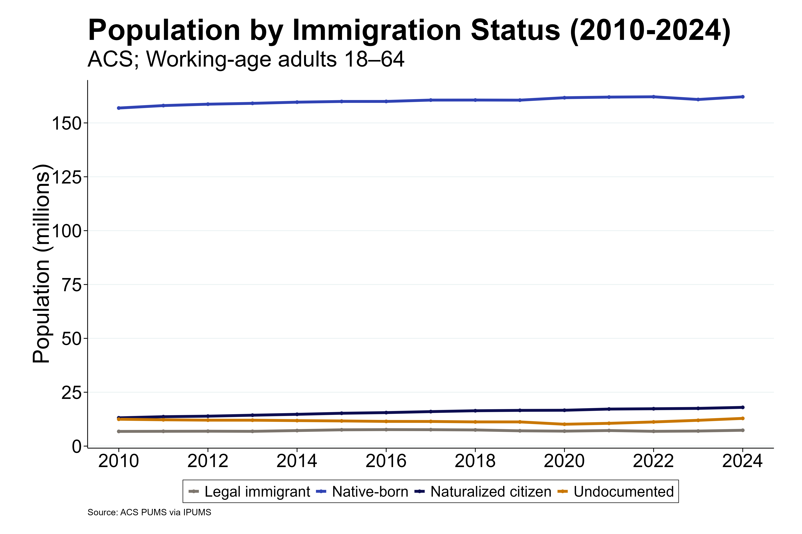

# Health Coverage (ACS)
[Table, All Years](results/coverage_counts_year.csv)

### 2024 vs. 2010
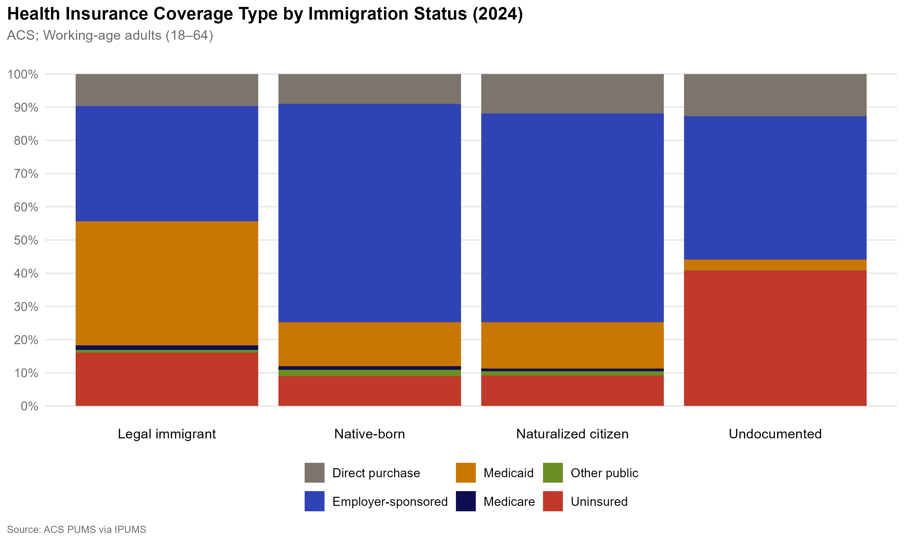 
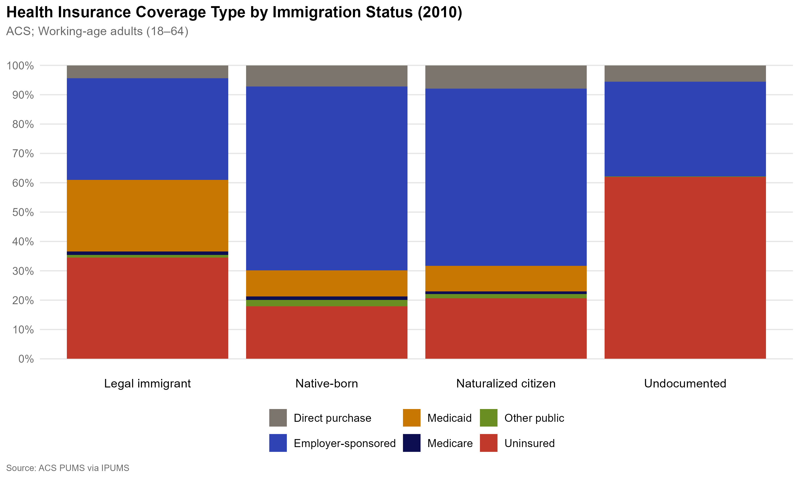 

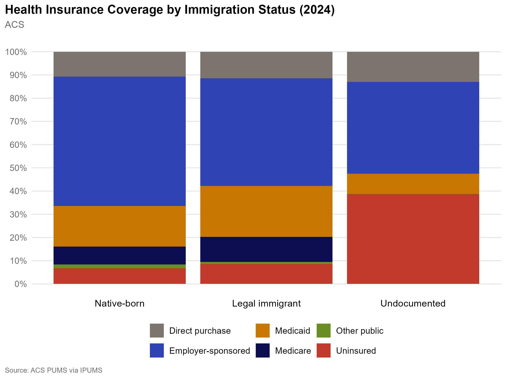
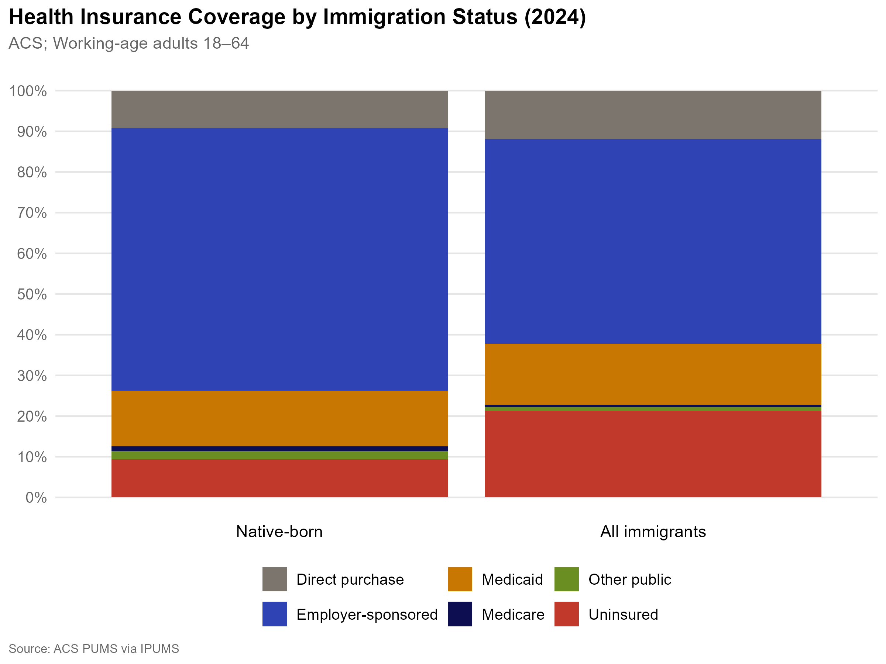
[Table, Native-born VS. All Immigrants](results/coverage_counts_year.csv)

### Uninsured 
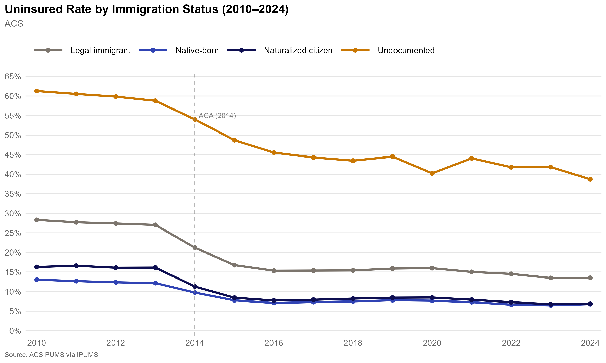
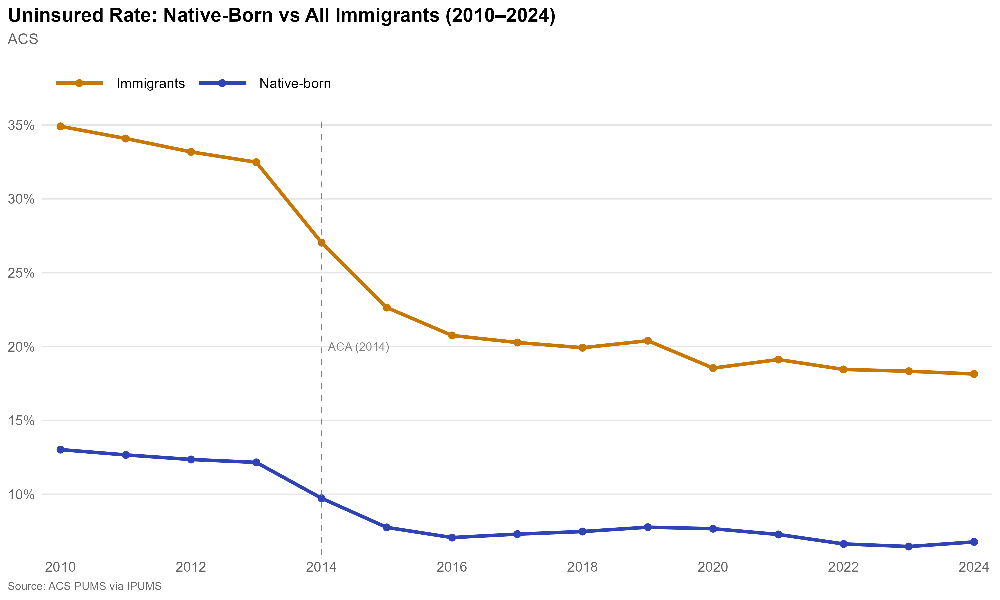

### Medicaid Coverage
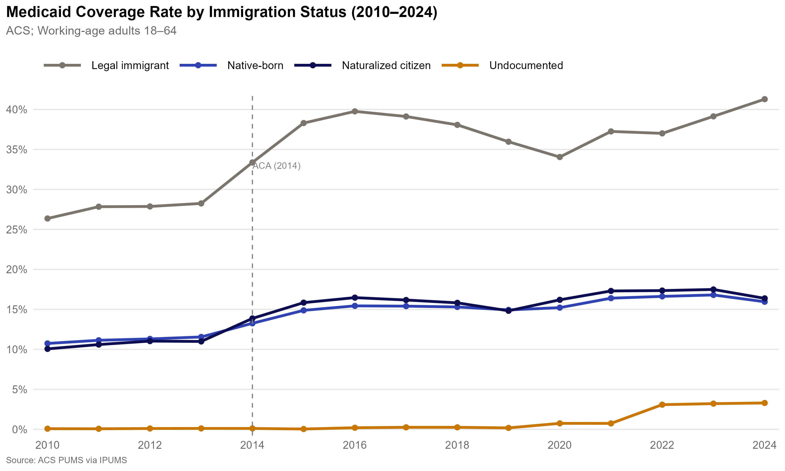
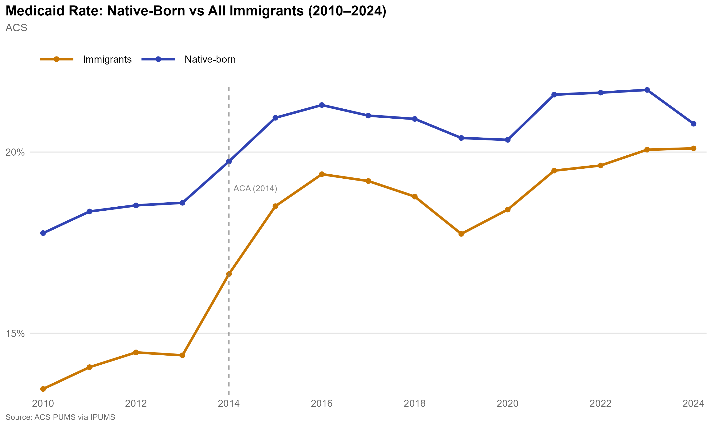

### Employer-Sponsored Insurance
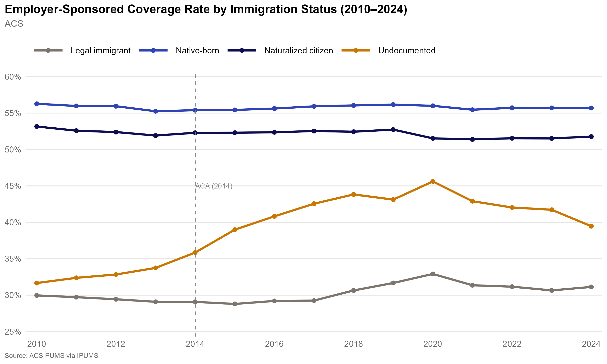

## State Health Coverage Expansions for Undocumented Immigrants
As of March 2024, six states and DC have expanded coverage to income-eligible adults regardless of immigration status: California, Colorado, Illinois, New York, Oregon, Washington, and DC. 

## Age
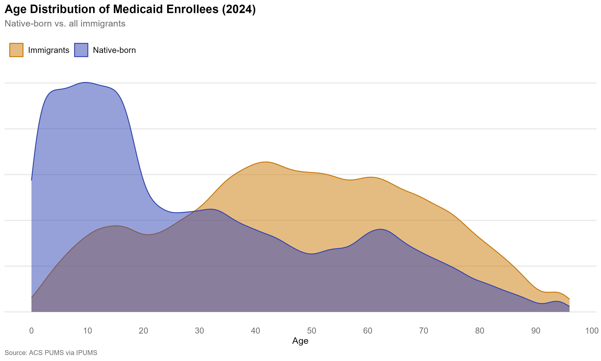

### Adult Coverage Expansions
| State | Program | Population Covered | Year |
|-------|---------|-------------------|------|
| California | Medi-Cal | Children under 19 | 2016 |
| California | Medi-Cal | Young adults under 26 | 2020 |
| California | Medi-Cal | Adults 50 and older | 2022 |
| California | Medi-Cal | All adults 26–49 | 2024 |
| Oregon | Oregon Health Plan | All ages, full expansion | 2022 |
| Illinois | HBIA/HBIS | Adults 42 and older | 2022 |
| New York | Medicaid | Adults 65 and older | 2024 |
| Colorado | OmniSalud | Adults up to 150% FPL (capped) | 2023 |
| Washington | Cascade Care | Adults up to 250% FPL (limited funding) | 2024 |
| Minnesota | MinnesotaCare | Adults | 2024 |
| DC | Medicaid | All residents | 2010 |

### Children-Only Coverage Expansions
| State | Year |
|-------|------|
| California | 2016 |
| Illinois | 2012 |
| Massachusetts | 2006 |
| New York | 2001 |
| Oregon | 2012 |
| Washington | 2009 |
| New Jersey | 2018 |
| Connecticut | 2010 |
| Maine | 2019 |
| Rhode Island | 2007 |
| Utah | 2017 |
| Vermont | 2015 |