# ACS data (2010-2024)

## Health Coverage (ACS)
[Table, All Years](results/coverage_counts_year.csv)

 
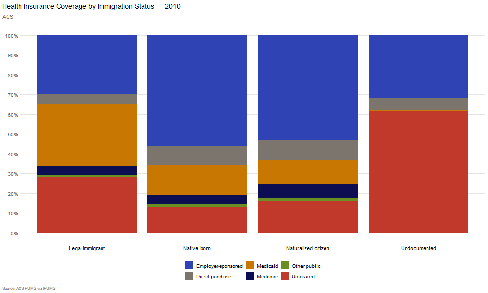 

[Table, Native-born VS. All Immigrants](results/coverage_counts_year.csv)

### Uninsured 

### Medicaid Coverage

### Employer-Sponsored Insurance

## Age
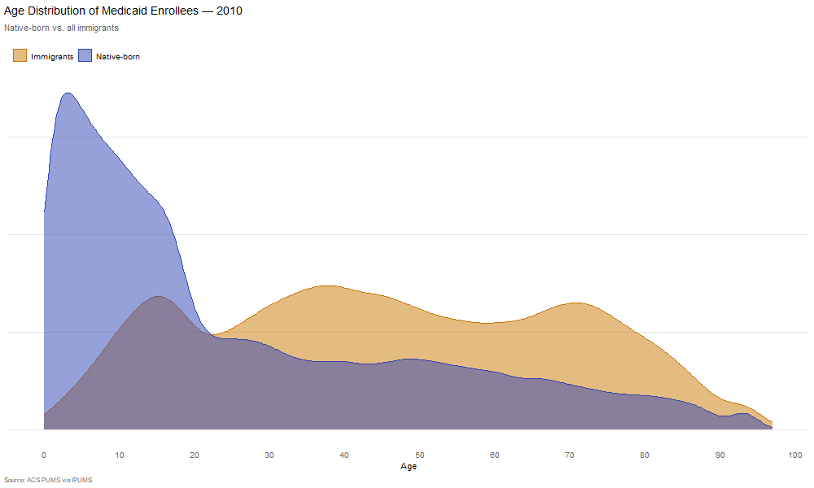
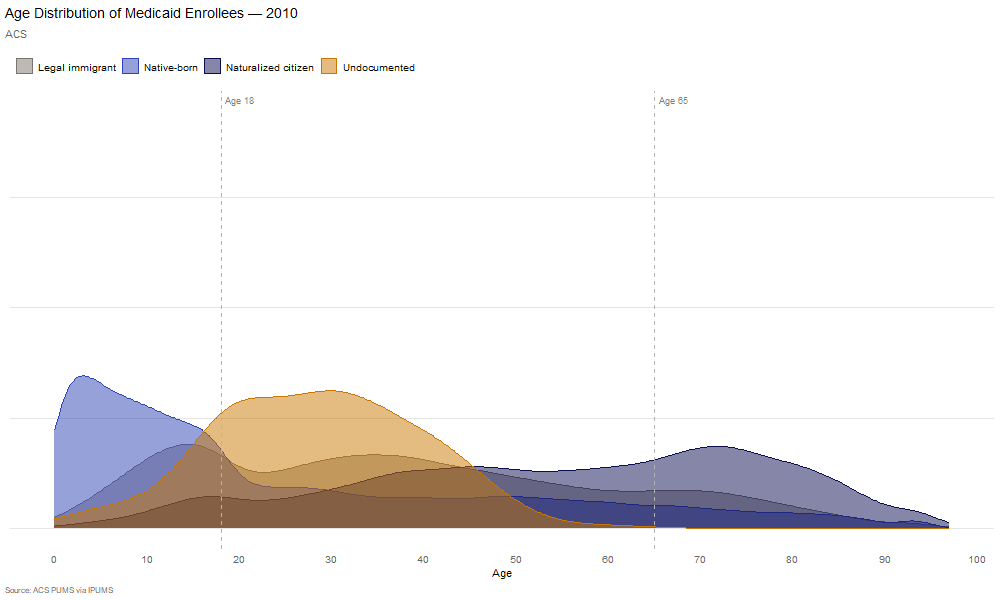
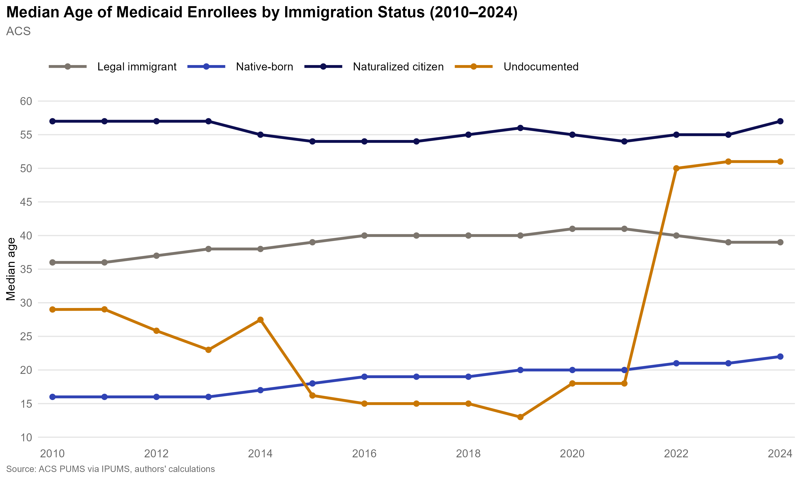
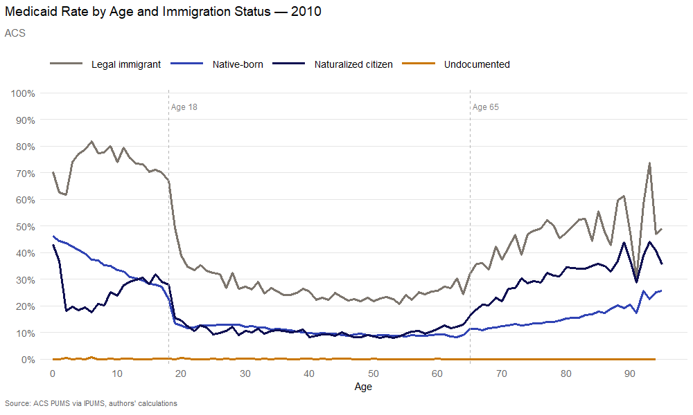
[Table](results/ACS_medicaid_age.csv)

### State Health Coverage Expansions for Undocumented Immigrants
As of 2024, seven states and DC have expanded coverage to income-eligible adults regardless of immigration status: California, Colorado, Illinois, New York, Oregon, Washington, and DC. 

### Adult Coverage Expansions
| State | Program | Population Covered | Year |
|-------|---------|-------------------|------|
| California | Medi-Cal | Children under 19 | 2016 |
| California | Medi-Cal | Young adults under 26 | 2020 |
| California | Medi-Cal | Adults 50 and older | 2022 |
| California | Medi-Cal | All adults 26–49 | 2024 |
| Oregon | Oregon Health Plan | All ages, full expansion | 2022 |
| Illinois | HBIA/HBIS | Adults 42 and older | 2022 |
| New York | Medicaid | Adults 65 and older | 2024 |
| Colorado | OmniSalud | Adults up to 150% FPL (capped) | 2023 |
| Washington | Cascade Care | Adults up to 250% FPL (limited funding) | 2024 |
| Minnesota | MinnesotaCare | Adults | 2024 |
| DC | Medicaid | All residents | 2010 |

### Children-Only Coverage Expansions
| State | Year | Age Coverage | Notes |
|-------|------|-------------|-------|
| Illinois | 2006 | Under 19 | First state — "All Kids" program |
| Washington | 2007 | Under 19 | "Apple Health for Kids" |
| Connecticut | ~2010 | Under 15 | Coverage may continue to 19 if already enrolled |
| New York | 2014 | Under 19 | Child Health Plus B |
| California | 2016 | Under 19 | Health4All Kids — subsequently expanded to all ages |
| New Jersey | 2018 | Under 19 | CHIP infrastructure |
| Oregon | 2018 | Under 19 | Cover All Kids |
| Rhode Island | 2022 | Under 19 | Children and pregnant people |
| Maine | 2022 | Under 19 | |
| Vermont | 2022 | Under 19 | 

### States with Coverage Expansions, Regardless of Immigration Status
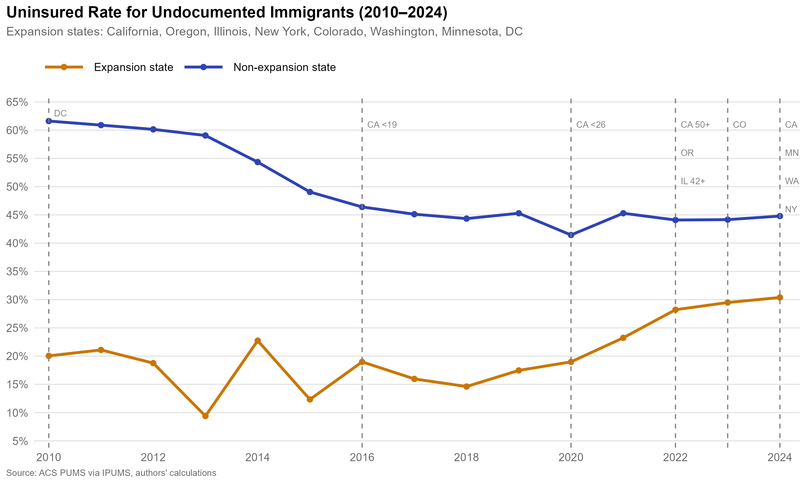
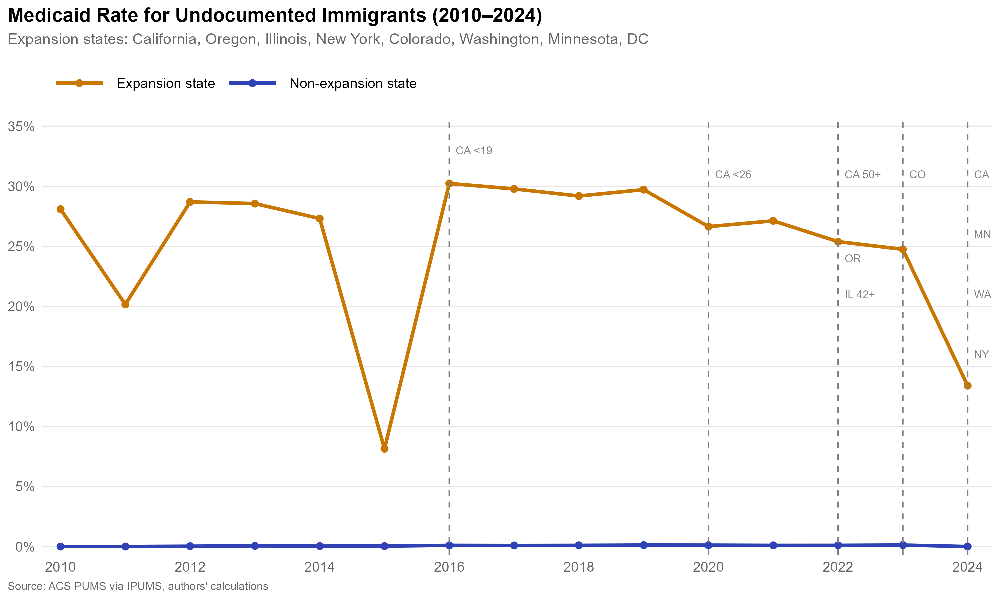

### California
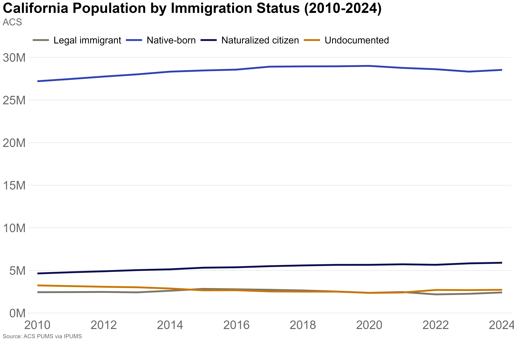
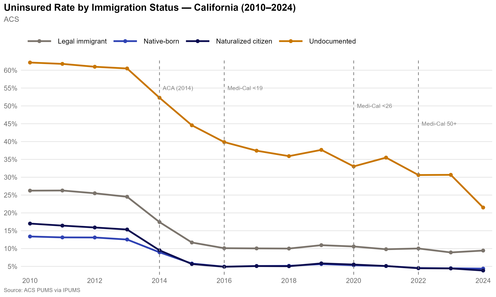
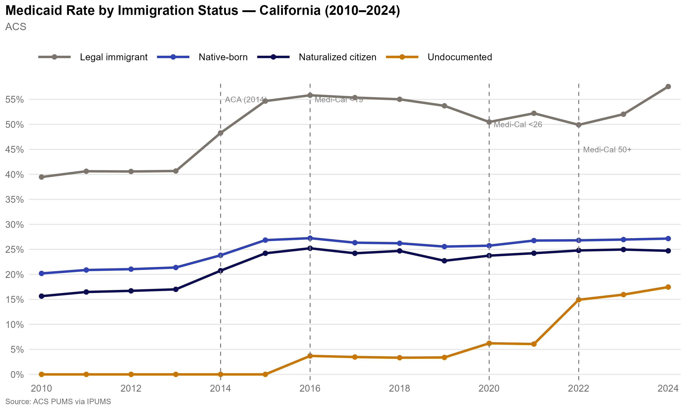
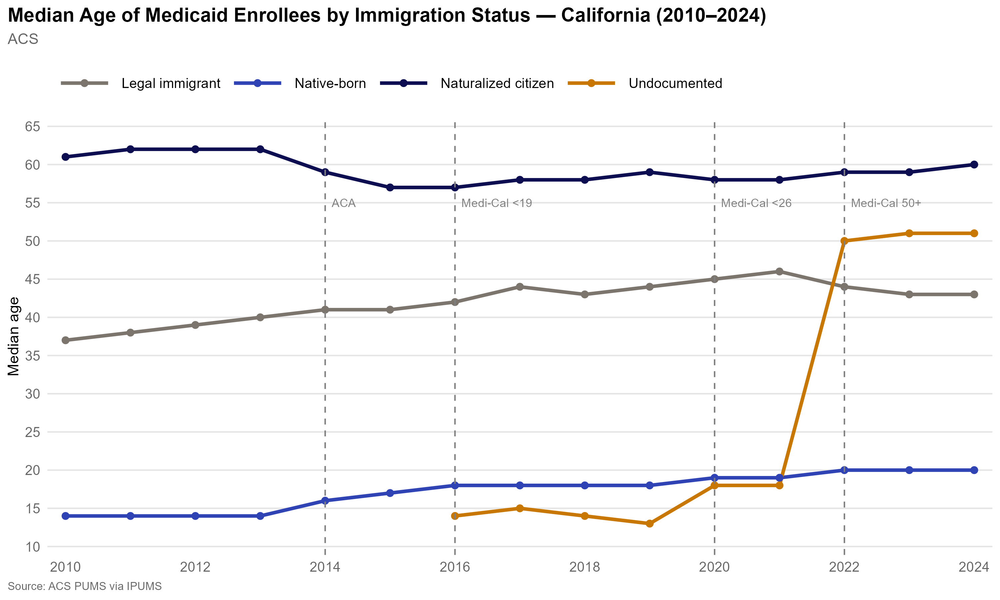
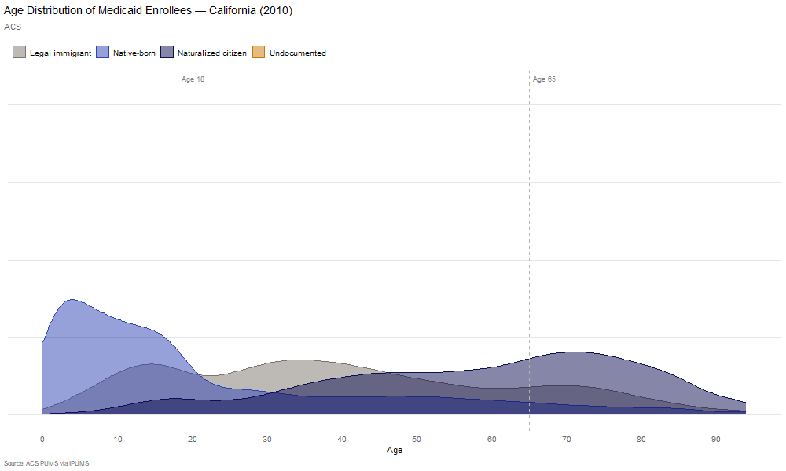
### Median Age of Medicaid Enrollees, EXCLUDING CALIFORNIA
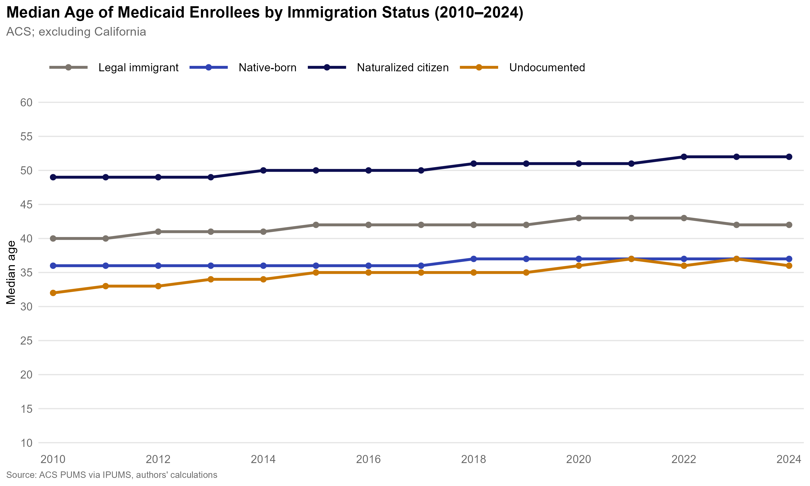